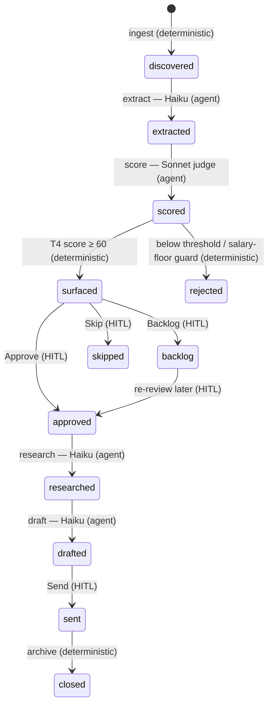

# Architecture

## System overview

`job-hunter-agent` is a small, event-driven system with three moving parts that
share one PostgreSQL database:

1. **Harvester** (`job_hunter.run`) — ingests new postings, extracts and scores
   them, and notifies the operator about the ones newly surfaced this run. Runs
   one-shot (cron-friendly) or as the daily 10:00-local job inside the bot.
2. **Bot** (`job_hunter.serve`) — aiogram long-polling. Delivers surfaced cards
   with inline buttons and handles the operator's taps (Approve / Backlog / Skip,
   and Send at the draft gate), driving the pipeline forward.
3. **Dashboard** (`job_hunter.webapi`) — a FastAPI app serving a React SPA, for
   reviewing the pipeline and taking the same actions from a browser.

The harvester and the bot can run in the same process (the deployed bot fires
the daily harvest on its own event loop) or separately (a one-shot `run` for
manual harvests). Everything is built around a single, deterministic state
machine.

## The pipeline as a state machine

Each posting is one `work_items` row that advances through a fixed set of states.
Transitions are typed by who triggers them: **deterministic** (pure rules),
**agent** (an LLM step), or **HITL** (a human decision).



ASCII view of the happy path:

```
ingest        extract        score          surface gate      research   draft     send
(determ.)     (Haiku)        (Sonnet)       (HITL)            (Haiku)    (Haiku)   (HITL)
   │             │              │                │                │         │         │
discovered → extracted → scored ──► surfaced ──► approved ──► researched ─► drafted ─► sent ─► closed
                           │            │
                           └► rejected  ├► backlog  (re-reviewable)
                                        └► skipped
```

- **ingest** — defaults to the public `t.me/s/` web reader (no auth, no
  credentials); an optional Telethon userbot mode exists behind `INGEST_MODE`.
  Each channel's read cursor lives in `channel_state` so harvests are incremental.
- **extract** — Claude Haiku parses raw post text into a structured Extract
  schema (title, stack, seniority, salary, contact, …). A deterministic regex
  heuristic is the fallback if the LLM response can't be parsed.
- **score** — a rubric-driven Claude Sonnet judge returns `relevance_score`
  (0–100) plus a human-readable rationale. A deterministic salary-floor guard
  then converts the posting's salary to a common currency via live FX and can
  reject below the candidate's floor — independent of the model. Surface
  threshold is 60; the 50–59 **borderline** band is surfaced for separate review.
- **surface gate** — the bot/dashboard present the card; the human chooses
  Approve, Backlog, or Skip.
- **research / draft** — run **only after Approve**: Haiku researches the company
  (source-grounded, see Security) and drafts an application. The human reviews
  and taps Send.

The full transition table and the Extract schema are specified in `DESIGN.md`;
the scoring rubric in `SCORING.md`.

## `advance()` is the single writer

All state changes go through one function, `pipeline.advance(item, …)`. Nothing
else writes `work_items.state`. This is deliberate:

- **One consistent place owns transitions.** Validity (is this transition legal
  from the current state?), the audit record, and the resulting state are decided
  together, so the machine can't be driven into an illegal state from two code
  paths that disagree.
- **The same writer serves both paths.** The automated harvest (`run_to_gate`,
  which drives an item as far as the next human/terminal gate) and the human
  actions (bot taps, dashboard POSTs) both call `advance()`. There is no second
  "shortcut" that mutates state, so the harvester and the UI can never diverge.
- **Every transition is auditable.** `advance()` writes a `state_transitions`
  row (from-state, to-state, transition id, actor, reason) for each move, giving
  a complete per-item history that the dashboard renders.

## Data model (conceptual)

Four tables, defined in `migrations/schema_pg.sql`:

- **`work_items`** — one row per posting: the raw text, the extracted JSON
  (structured fields + score + research/draft payloads), the current `state`,
  and source metadata. The unit of work the state machine advances.
- **`state_transitions`** — the append-only audit log: every `advance()` call
  records from-state → to-state, the transition id, the actor (deterministic /
  agent / which human), and a reason. This is the per-item timeline.
- **`channel_state`** — per-source ingest cursors, so each harvest reads only new
  messages (incremental ingest, no re-processing the whole channel).
- **`ops_heartbeat`** — operational timestamps (e.g. last successful harvest),
  read by the staleness watchdog (see Observability).

Postgres is reached via psycopg 3. The deployment shares an existing Postgres
instance; the dashboard additionally uses a separate auth database for login
grants (see below).

## Security

**SSRF guard on web research.** Company research fetches arbitrary URLs found in
postings, which is a classic SSRF vector. The fetcher defends in depth:

- It resolves **all** A/AAAA records for the host and **rejects the whole host
  if any record is private** — loopback (`127.0.0.0/8`, `::1`), RFC1918
  (`10/8`, `172.16/12`, `192.168/16`), link-local / cloud metadata
  (`169.254.0.0/16`, incl. `169.254.169.254`), and IPv6 ULA/link-local.
- It does **not** trust a single pre-flight check: every redirect hop is
  re-resolved and re-validated before being followed, closing the
  redirect-to-internal bypass.
- Each fetched page is truncated (~6,000 chars) before it reaches the model,
  bounding both prompt cost and blast radius.

This is "resolve-all + reject-if-any-private + per-hop revalidation" rather than
socket-level IP pinning — a documented, pragmatic trade-off (the residual
TOCTOU rebind window is tiny and requires attacker-controlled DNS).

**Authentication & SSO.** The dashboard authenticates via Telegram Login. A
signed session cookie is scoped to the parent domain so it works as
single-sign-on across the operator's subdomains, and access is gated by a
grants table plus an explicit superuser allowlist. The bot itself only acts on
taps from allowlisted Telegram IDs.

**Least privilege.** The container starts as root only to drop to a non-root
user (uid 10001) via the entrypoint before running the app. Real secrets and the
real candidate profile live on the host and are bind-mounted (the profile
read-only); they are never baked into the image.

## Observability

- **Heartbeat + staleness watchdog.** `serve` writes a heartbeat every 30s; the
  harvest records its last-success time in `ops_heartbeat`. A watchdog alerts if
  the harvest goes stale (e.g. > 26h), catching a scheduler that silently stopped.
- **Container health.** The Compose healthcheck fails the container if the
  heartbeat file is older than 90s — catching a *wedged* event loop, not just a
  dead PID — and `restart: unless-stopped` revives it.
- **Telegram ops logging.** Optional startup pings (with the deployed git sha)
  and error notifications post to a separate ops topic; unset → silent no-op.

## Deployment

Two Docker Compose services built from one shared image:

- **`job-hunter`** — the long-lived bot: aiogram long-polling **plus** the daily
  10:00-local harvest, one event loop. Outbound-only (no published ports).
- **`dashboard`** — uvicorn serving the FastAPI app + the built React bundle,
  published on the VPS loopback and exposed publicly only through Caddy (TLS).

The two services are independent (no `depends_on`), so recreating the dashboard
never disturbs the running bot. CI deploys on push to `main`: SSH to the VPS,
`git pull`, then `docker compose up -d --build job-hunter dashboard`. The React
bundle is built inside the image; the git sha is injected as a build arg for the
startup ping. The real display name and avatar are supplied as **out-of-repo
build inputs** (a VPS-only env var and a gitignored asset), so the repo and its
history stay fully de-identified while the deployed dashboard shows real data.

## Deliberate scope choices (right-sized, not under-built)

This runs on **one VPS with Docker Compose** — intentionally. There is no
Kubernetes, no Terraform, no service mesh, no message broker. That is a
considered decision, not a gap:

- The workload is one bot and one low-traffic dashboard serving a **single
  operator**, harvesting ~13 postings once a day. There is nothing to autoscale
  and no multi-node availability target to justify an orchestrator.
- Compose already gives the properties that matter here: process supervision
  (`restart: unless-stopped`), health-gated restarts, isolated services, and a
  one-command reproducible deploy. Postgres is a shared, already-operated
  instance.
- The complexity a cluster would add (control plane, manifests, secret
  management, an ingress stack) is pure operational overhead for this scale —
  cost and failure surface with no benefit.

The engineering effort instead went where it pays off at this scale:
correctness (a single state writer, an audit log), safety (the SSRF guard,
least-privilege containers, auth), cost discipline (tiered model routing,
prompt caching), and graceful degradation (every external dependency has a
fallback). Scaling levers — moving to managed Postgres, splitting the harvester
into its own scheduled task, adding the vector-search competency service — are
straightforward to add **if** the requirements ever appear, and are deliberately
deferred until then.
